<picture>
  <source media="(prefers-color-scheme: dark)" srcset="./assets/header-dark.svg">
  <source media="(prefers-color-scheme: light)" srcset="./assets/header-light.svg">
  
</picture>

 

&nbsp;

<picture>
  <source media="(prefers-color-scheme: dark)" srcset="./assets/divider-dark.svg">
  <source media="(prefers-color-scheme: light)" srcset="./assets/divider-light.svg">
  
</picture>

## 👋 About Me

I'm a **second-year B.Tech Computer Science & Engineering student at Amity University** exploring the intersection of **Software Development and AI/ML**.

I like learning by building, experimenting with ideas, and understanding how systems work under the hood.

> **Build. Break. Understand. Build again.**

<picture>
  <source media="(prefers-color-scheme: dark)" srcset="./assets/about-dark.svg">
  <source media="(prefers-color-scheme: light)" srcset="./assets/about-light.svg">
  
</picture>

## 🚀 What I'm Working On

### 🛰️ DEADNAVS — GNSS Dead-Reckoning & Telemetry

An Android-based dead-reckoning and telemetry platform for high-frequency motion tracking and navigation analysis.

**Focus:** `GNSS` · `Sensor Fusion` · `Telemetry` · `Navigation` · `Data Analysis`

### 🤖 AI / ML

Exploring machine learning fundamentals and curiosity-driven AI through experimentation and research, with a focus on understanding the fundamentals behind intelligent systems.

---

## 🔬 Research

### Curiosity-Driven AI Agents

**Developing Curiosity Driven AI Agents: Bridging Human Brain Mechanisms with Current Reinforcement Learning Techniques**

Explored curiosity-inspired mechanisms, intrinsic motivation, and reinforcement learning approaches for encouraging exploration in AI agents.

---

## 🛠️ Languages & Tools

### Programming

  
  
  
  

### Development & Systems

  
  
  
  
  
  

### AI / Data

  
  
  
  

---

## 📊 GitHub Analytics

<picture>
  <source media="(prefers-color-scheme: dark)" srcset="./assets/github-stats-dark.svg">
  <source media="(prefers-color-scheme: light)" srcset="./assets/github-stats-light.svg">
  
</picture>

  

<picture>
  <source media="(prefers-color-scheme: dark)" srcset="./assets/languages-dark.svg">
  <source media="(prefers-color-scheme: light)" srcset="./assets/languages-light.svg">
  
</picture>

## 🔥 Contribution Streak

<picture>
  <source media="(prefers-color-scheme: dark)" srcset="./assets/streak-dark.svg">
  <source media="(prefers-color-scheme: light)" srcset="./assets/streak-light.svg">
  
</picture>

## 📈 Contribution Activity

<picture>
  <source media="(prefers-color-scheme: dark)" srcset="./assets/contributions-dark.svg">
  <source media="(prefers-color-scheme: light)" srcset="./assets/contributions-light.svg">
  
</picture>

## 🧩 LeetCode

<picture>
  <source media="(prefers-color-scheme: dark)" srcset="./assets/leetcode-dark.svg">
  <source media="(prefers-color-scheme: light)" srcset="./assets/leetcode-light.svg">
  
</picture>

 

---

## 🏆 GitHub Achievements

<picture>
  <source media="(prefers-color-scheme: dark)" srcset="https://github-profile-trophy.vercel.app/?username=aryankr01&theme=onedark&no-frame=true&no-bg=true&margin-w=8">
  <source media="(prefers-color-scheme: light)" srcset="https://github-profile-trophy.vercel.app/?username=aryankr01&theme=flat&no-frame=true&no-bg=true&margin-w=8">
  
</picture>

---

## 🤝 Connect With Me

&nbsp;&nbsp;&nbsp;

&nbsp;&nbsp;&nbsp;

&nbsp;&nbsp;&nbsp;

---

<b>🏅 Beyond Code</b>

 

🥋 **1st Dan Black Belt — Traditional Shito-Ryu Karate**

🌍 **Model United Nations Delegate** — Participated in two MUN conferences.

🤝 **Community Engagement & Social Impact Volunteer** — 75 hours of volunteer service.

<b>💬 A little more about me</b>

 

I'm interested in the intersection of **software, artificial intelligence, and real-world systems**.

I enjoy taking an idea, understanding how it works under the hood, and turning it into something functional.

Currently focused on strengthening my **programming fundamentals, DSA, software development, and AI/ML** skills.

### ⚡ Fun Fact

**I can run fast, but my code runs faster.** 🏃‍♂️💻

 

<picture>
  <source media="(prefers-color-scheme: dark)" srcset="./assets/footer-dark.svg">
  <source media="(prefers-color-scheme: light)" srcset="./assets/footer-light.svg">
  
</picture>

